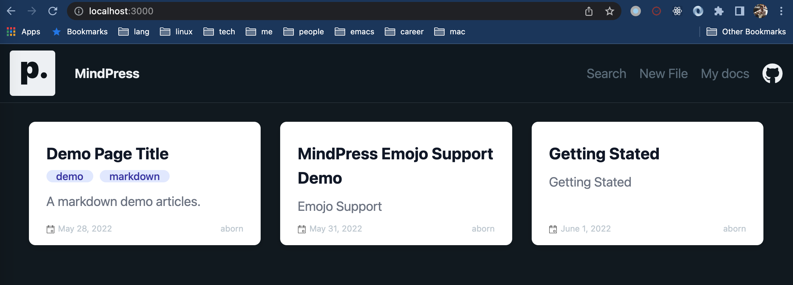
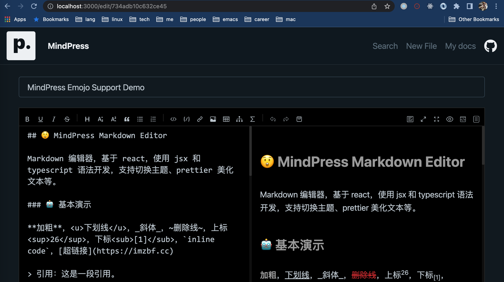
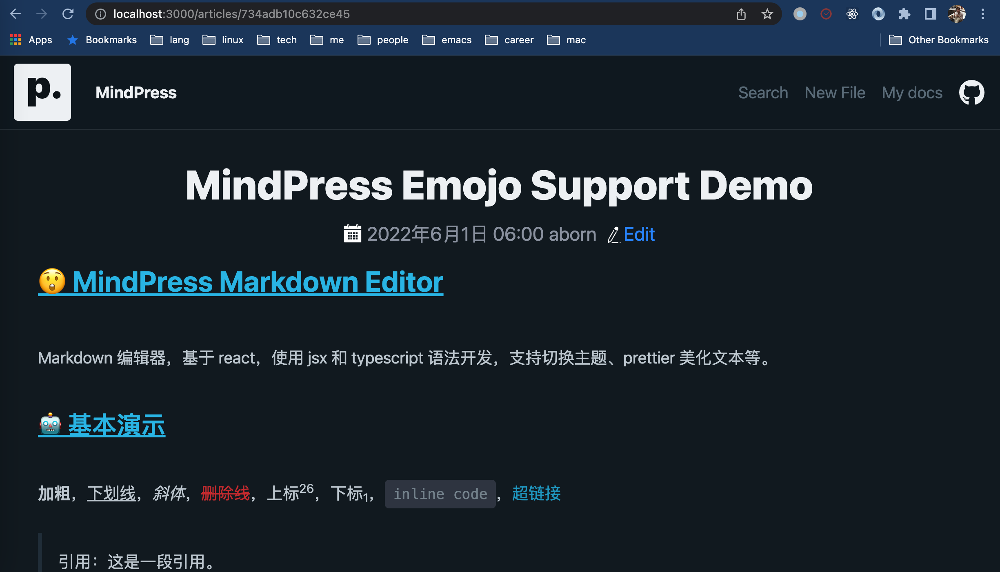
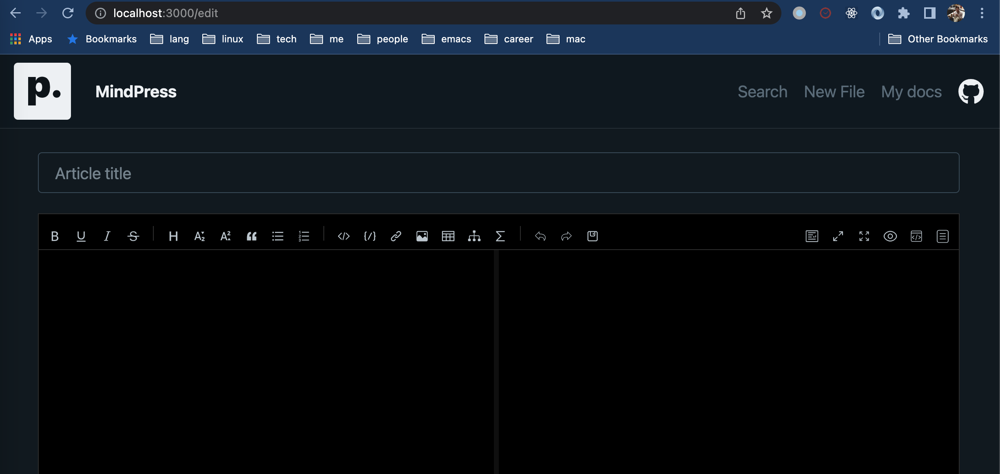
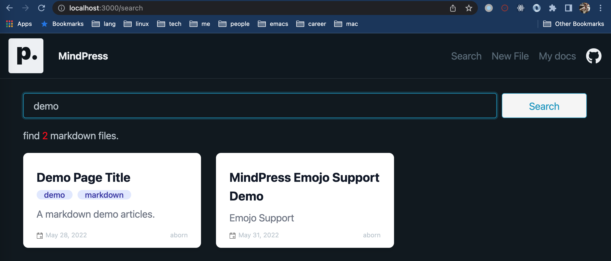
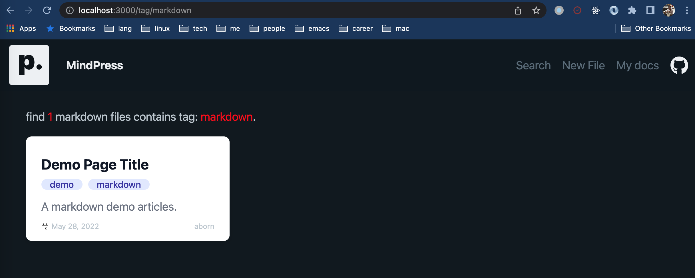
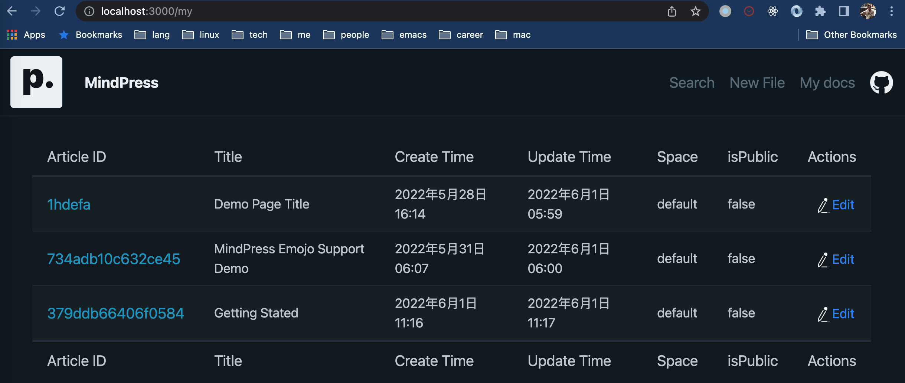

# MindPress
[](https://github.com/aborn/mindpress/actions/workflows/cd.yml)

Press your mind(markdown) gracefully, which is powered by [nuxt.js 3.0](https://v3.nuxtjs.org) and [nuxt content 2.0](https://github.com/nuxt/content). Markdown editor use [md-editor-v3](https://github.com/imzbf/md-editor-v3). Mindpress provides three modes: `SSG` (default), `FCM` and `SCM`. 

For `SSG`, mindpress use nuxt static site generation (SSG) prerenders every route of your markdown files at build time. Here is static site example [https://aborn.github.io/mindpress/](https://aborn.github.io/mindpress/), which is hosted by github pages.  

For `FCM` and `SCM`, you can edit/save markdown file upstream from another api server. Here is an java language server api implementation [mindpress-serv](https://github.com/aborn/mindpress/mindpress-serv). 

## 1. MindPress Modes
### 1.1 SSG
SSG, Static Site Generation. Mindpress use nuxt SSG generate static pages. SSG can be deployed in Github Pages, here is an example [https://aborn.github.io/mindpress/](https://aborn.github.io/mindpress/).

### 1.2 FCM
FCM, File-based Content Management System. This mode deployed in node server.

### 1.3 SCM
SCM, Server-based Content Management). This mode deployed in another server. [mindpress-serv](https://github.com/aborn/mindpress/mindpress-serv) is the implementation server api.

## 2. Preview
1. The home page `/`  



2. Edit file `/edit/articleid`  



3. Markdown file(article) detail `/article/articleid`  



4. Create new file `/edit`



5. Search by keyword `/search`



6. Tag group page `/tag/your_query_tag`



7. My space docs `/my`  



## 3. How to development

### 3.1 Nuxt fronted dev
Make sure to install the dependencies: (Node 18+)

1. Setup 

```bash
# yarn
yarn install

# npm
npm install

# pnpm
pnpm install --shamefully-hoist
```

2. Startup
Start the development server on http://localhost:3012

```bash
yarn dev
```

### 3.2 Development Server (Optional)
Make sure to install Java 17+ env.

Boot up `mindpress-serv` backed api server.


## 4. Deploy in production env.

### 4.1 Docker deploy (Recommended)
All docker deploy scripts in `scripts/docker`

### 4.2 Deploy from source

Build the application for production:

```bash
npm run build
```

Locally preview production build:

```bash
npm run preview
```

Checkout the [deployment documentation](https://v3.nuxtjs.org/docs/deployment) for more information.
