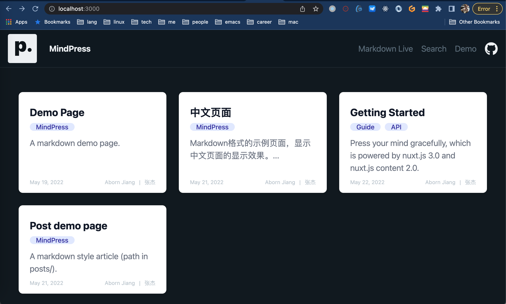
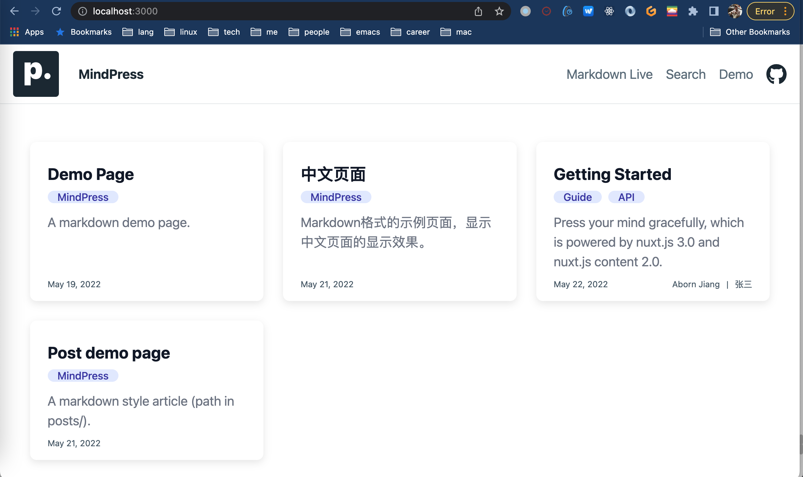
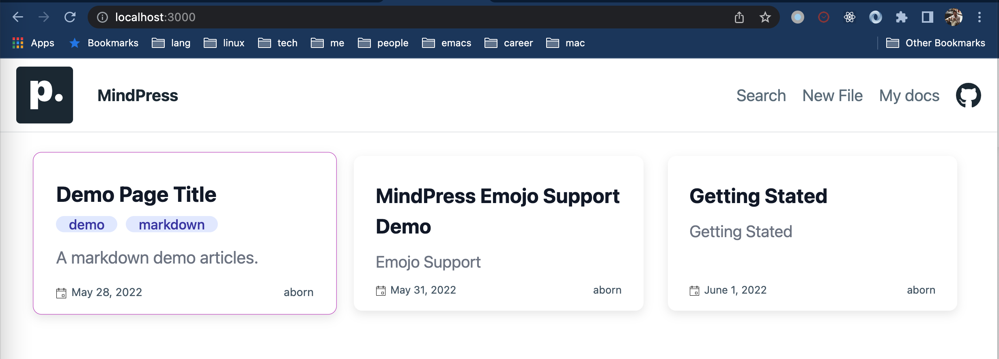
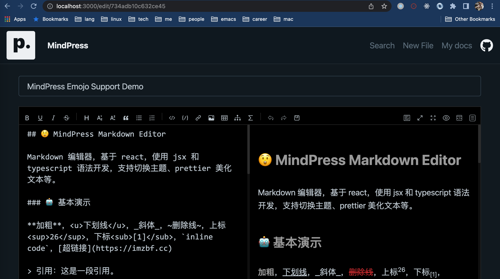
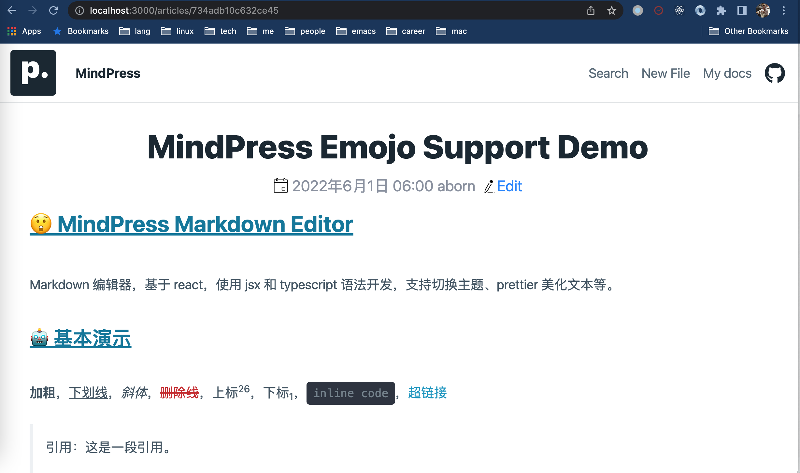
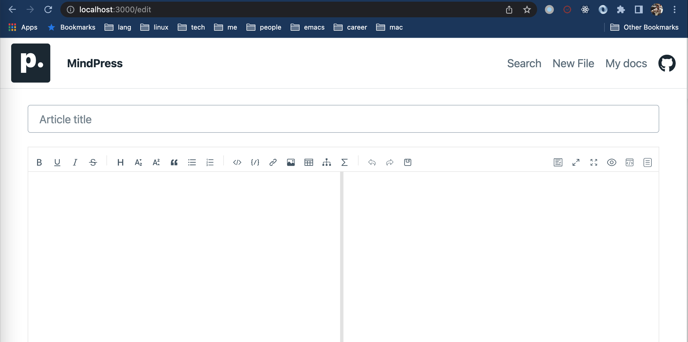
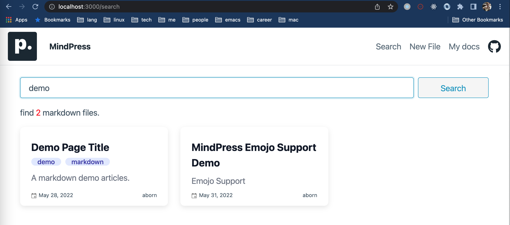
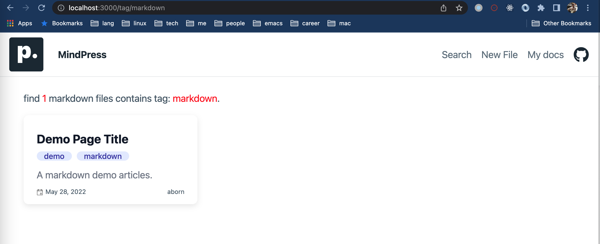
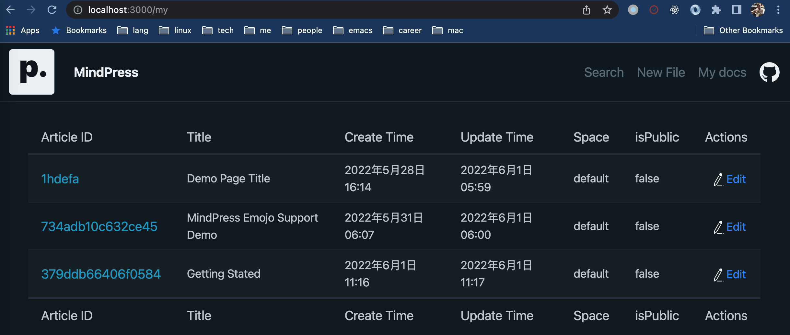

# MindPress

Press your mind(markdown) gracefully, which is powered by [nuxt.js 3.0](https://v3.nuxtjs.org) and nuxt.js content 2.0. MindPress provide two mode: `server` and `static` (default). For `server mode`, the markdown file edit and update upstream from another server. An java language server implementation here [mindpress-serv](https://github.com/aborn/mindpress-serv).




## server mode
1. The home page  



2. Edit file  



3. Markdown file(article) detail



4. Create new file



5. Search by keyword



6. Tag group page



7. My space docs



## Setup

Make sure to install the dependencies:

```bash
# yarn
yarn install

# npm
npm install

# pnpm
pnpm install --shamefully-hoist
```

## Development Server

Start the development server on http://localhost:3000

```bash
npm run dev
```

## Production

Build the application for production:

```bash
npm run build
```

Locally preview production build:

```bash
npm run preview
```

Checkout the [deployment documentation](https://v3.nuxtjs.org/docs/deployment) for more information.
