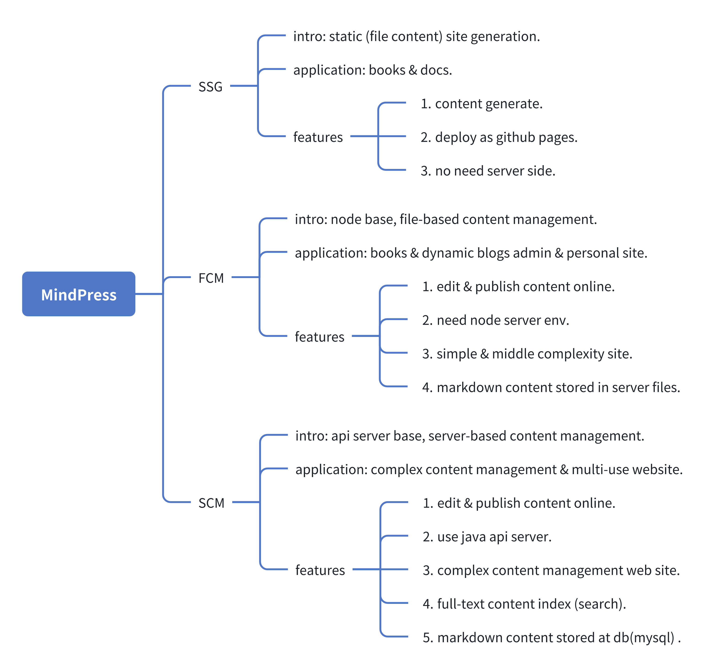

# MindPress
[](https://github.com/aborn/mindpress/actions/workflows/cd.yml)

Press your mind(markdown) gracefully, which is powered by [nuxt.js 3.0](https://v3.nuxtjs.org) and [nuxt content 2.0](https://github.com/nuxt/content). Markdown editor use [md-editor-v3](https://github.com/imzbf/md-editor-v3). Mindpress provides three modes: `SSG` (default), `FCM` and `SCM`. 

`SSG`, mindpress uses nuxt static site generation (SSG) prerenders every route of your markdown files when building. Here is static site example [https://aborn.github.io/mindpress/](https://aborn.github.io/mindpress/), which is hosted by github pages.  

`FCM` and `SCM` modes, you can edit/save markdown file upstream from another api server. Here is an java language api implementation [mindpress-serv](https://github.com/aborn/mindpress/mindpress-serv). 

## 1. MindPress modes


### 1.1 SSG
SSG, **S**tatic **S**ite **G**eneration. Mindpress uses nuxt SSG generate static pages. SSG can be deployed in Github Pages, here is an example [https://aborn.github.io/mindpress/](https://aborn.github.io/mindpress/).
```
yarn dev:ssg
```

### 1.2 FCM
FCM, **F**ile-based **C**ontent **M**anagement System. This mode deployed in node server.
```
yarn dev:fcm
```

### 1.3 SCM
SCM, **S**erver-based **C**ontent **M**anagement. This mode deployed in another server. [mindpress-serv](https://github.com/aborn/mindpress/mindpress-serv) is the implementation server api.
```
yarn dev:scm
```

## 2. How to develop.

### 2.1 Nuxt fronted dev
**Make sure you have node 18+ env**.  

Setup, install deps and boot up.

```bash
cd mindpress-fe
yarn install
yarn dev:fcm  # yarn dev:scm  （scm mode）
```
Now the nuxt server boot up in http://localhost:7001

### 2.2 API server dev (optional)
Only for `SCM` mode (`yarn dev:scm` in 2.1)

**Make sure you have Java 17+ env**.  

Boot up `mindpress-serv` backend api server.
The api server boot up in http://localhost:3012

Note: `FCM` and `SSG` nodes, we don't need api server!

## 3. How to deploy.

### 3.1 Docker deploy (Recommended)
All docker deploy scripts in `scripts/docker`

For `FCM` mode
```
./scripts/docker/fcm/build.sh    # build nuxt
./scripts/docker/fcm/docker.sh   # make docker image and container and boot up
```
And docker container boot up in http://localhost:7010

### 3.2 Deploy from source code

Build the application and deploy it at production (`FCM` mode):

1. `SSG` mode build and deploy
```bash
cd mindpress-fe
yarn gh
```

2. `FCM` mode build and deploy
```bash
cd mindpress-fe
yarn install      # npm install
yarn build:fcm    # npm run build:fcm
yarn deploy:fcm
```

3. `SCM` mode build and deploy
Deploy serer first.
```bash
cd mindpress-fe
yarn install      # npm install
yarn build:scm    # npm run build:scm
yarn deploy:scm
```

## 4. Preview
1. The home page `/`  


2. Edit file `/edit/articleid`  


3. Markdown file(article) detail `/article/articleid`  


4. Create new file `/edit`


5. Search by keyword `/search`


6. Tag group page `/tag/your_query_tag`


7. My space docs `/my`  


